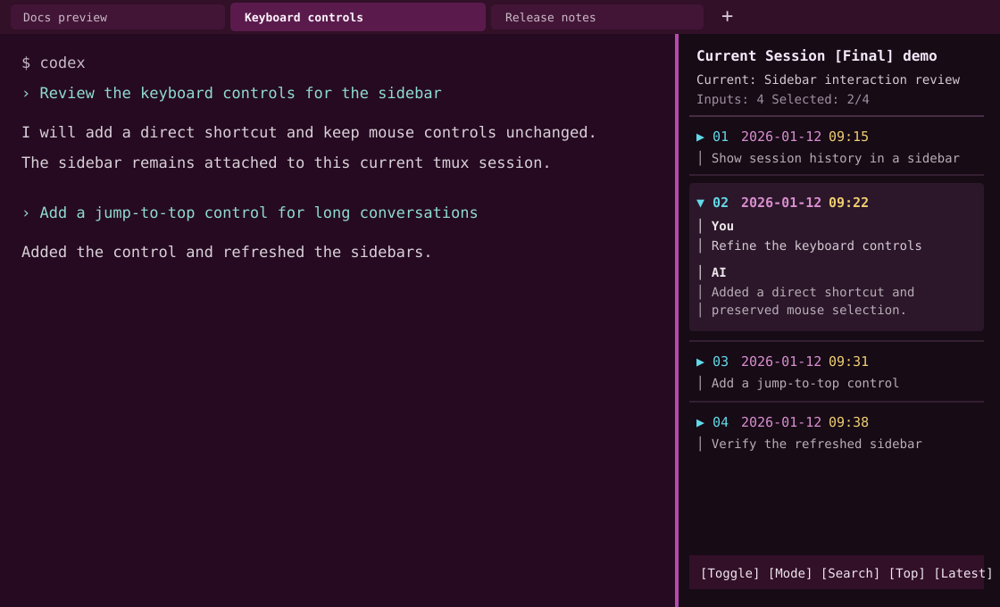

# tmux-context

`tmux-context` automatically names tmux sessions from the completed Codex task, shows a mouse-enabled sidebar for the current conversation, and keeps compatible terminal titles in sync.

It is a standalone extraction from `cs-session-manager`: no session index, archive database, or `cs` command is required.

## Preview



This is a deliberately fictional demonstration. The tab strip shows different task-based session names, while the active tab shows its current-session sidebar. It contains no user name, account, filesystem path, host name, session ID, or real conversation content.

## Support boundary

| Environment | Support | Notes |
|---|---|---|
| Linux terminal | Full | Requires Python 3.10+ and tmux 3.2+ |
| Windows Terminal + WSL2 | Full | Recommended Windows configuration |
| Windows PowerShell | Bridge | PowerShell invokes the same runtime inside WSL2 |
| Native PowerShell without WSL | Unsupported | tmux, `/proc`, and curses require a POSIX host |

PowerShell compatibility means that you can install, launch, diagnose, and attach from PowerShell while the session itself runs in WSL. It does not ship a separate Windows tmux implementation.

## Features

- Session titles prioritize the most recent meaningful task whose Codex response has completed.
- Weak text such as `继续`, raw shell commands, and image placeholders does not rename a session.
- The current-session sidebar supports mouse selection, collapsing one prompt at a time, expanding AI replies, scrolling, filtering, and hiding/showing reasoning output.
- In expanded text, one click sets a selection start; drag to an endpoint, or click the endpoint again, to copy only the selected body text. Headers, timestamps, and separators are excluded.
- On WSL, selected text is copied through Windows PowerShell with UTF-8 input, preserving Chinese and other Unicode text.
- Clipboard writes run in the background, so the selection highlight remains responsive while copying.
- Dragging text in a normal tmux pane copies it without leaving copy-mode, so historical output stays at its current position; press `q` or `Esc` when finished.
- Terminal titles use the tmux session name, with Windows Terminal setup available as an explicit command.
- `Ctrl-b H` toggles the sidebar; `Ctrl-b R` refreshes the current session name.

## Install from WSL or Linux

Install prerequisites, then clone the repository into the Linux filesystem:

```bash
sudo apt update
sudo apt install -y python3 tmux git
git clone https://github.com/<your-account>/tmux-context.git ~/workspace/tmux-context
cd ~/workspace/tmux-context
chmod +x tmux-context install.sh scripts/build-package.sh
./install.sh
./tmux-context doctor
```

Start an AI CLI from a regular shell so `tmux-context` can create the managed session and title watcher:

```bash
./tmux-context run --name assistant -- codex
```

If `codex` is not the command you use, replace it with the actual executable and arguments. Running `tmux-context run` inside an existing tmux client deliberately does not create a nested tmux server.

## Install and use from PowerShell

Clone the repository either in a Windows folder mounted by WSL (for example `C:\Users\<user>\source\tmux-context`) or in the WSL filesystem. In a PowerShell window opened at the repository root:

```powershell
Set-ExecutionPolicy -Scope Process Bypass
.\Install-TmuxContext.ps1 -Distribution Ubuntu
.\tmux-context.ps1 doctor
.\tmux-context.ps1 run --name assistant -- codex
```

`-Distribution` is optional when only one distribution is installed. If the repository is in a nonstandard WSL path, pass it explicitly:

```powershell
.\tmux-context.ps1 -Distribution Ubuntu -WslPath /home/<linux-user>/workspace/tmux-context doctor
```

`Install-TmuxContext.ps1` installs the tmux hook and, by default, updates Windows Terminal settings. Use `-SkipWindowsTerminal` to only install tmux integration.

## Windows Terminal titles

From WSL:

```bash
./tmux-context enable-windows-title
```

or from PowerShell:

```powershell
.\tmux-context.ps1 enable-windows-title
```

This backs up `settings.json`, sets `suppressApplicationTitle: false` for WSL profiles, and adds `Ctrl+Shift+F12` for the Windows Terminal tab-title editor. Close all Windows Terminal windows after changing settings. For an old manually fixed tab title, focus the tab, press `Ctrl+Shift+F12`, then `Ctrl+A`, `Backspace`, and `Enter`.

## Migration from cs-session-manager

Run `./tmux-context install` once. The installer removes the old managed `cs-session-manager` tmux source block and adds its own block; it saves a timestamped backup in `~/.tmux-context/tmux/backups/`. After migration, run only `tmux-context` commands to install or update tmux integration.

The standalone tool does not read `~/.cs/index.jsonl`. Current Codex conversation detection and session naming continue to work from the Codex JSONL session file.

## Commands

| Command | Purpose |
|---|---|
| `./tmux-context install` | Generate config and install the managed tmux hook |
| `./tmux-context uninstall` | Remove only this tool's managed tmux hook |
| `./tmux-context doctor` | Check tmux, entrypoint, generated config, and Windows Terminal discovery |
| `./tmux-context run --name <name> -- <command>` | Create and attach a managed tmux session |
| `./tmux-context client <session-id>` | Attach to an existing session with terminal-title monitoring |
| `./tmux-context enable-windows-title` | Configure Windows Terminal WSL title support |

## Build a portable archive

```bash
./scripts/build-package.sh
```

The command creates `dist/tmux-context-<version>.zip`. `dist/` is intentionally ignored by Git; publish it as a GitHub Release attachment if needed.

## Tests

```bash
python3 -m unittest discover -s tests -v
git diff --check
```

## Publish to GitHub

Choose a license before making the repository public; see [LICENSE-REQUIRED.md](LICENSE-REQUIRED.md). Then create an empty GitHub repository named `tmux-context` without an initial README or `.gitignore`.

Run the following only after reviewing the staged files and explicitly deciding the repository visibility:

```bash
git init
git add AGENTS.md README.md VERSION LICENSE-REQUIRED.md .gitignore \
  tmux-context tmux-context.ps1 install.sh Install-TmuxContext.ps1 \
  tmux_context.py scripts tests
git status
git commit -m "Initial release: tmux-context"
git branch -M main
git remote add origin git@github.com:<your-account>/tmux-context.git
git push -u origin main
```

With GitHub CLI, replace the last three commands with:

```bash
gh repo create tmux-context --public --source=. --remote=origin --push
```

Do not commit `dist/`, Windows Terminal backups, `~/.tmux-context/`, Codex session files, tokens, or account configuration.
